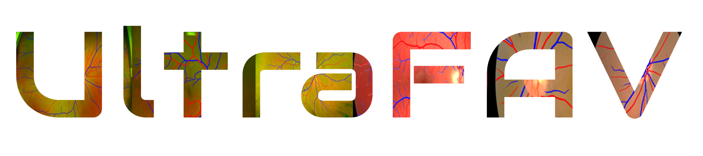
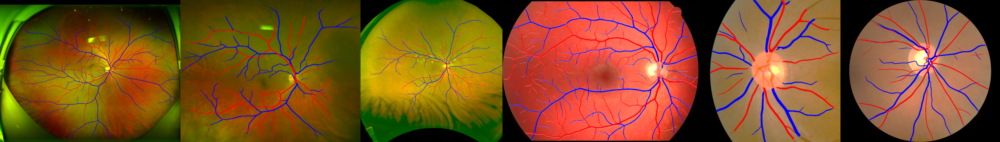

<p align="center">
 
    <h1 align="center">UltraFAV for Artery Vein Segmentation</h1>
</p>
<p align="center">
 
</p>

The **UltraFAV framework** provides a robust and efficient solution for the segmentation of retinal arteries and veins.

## Installation

### Step 1: Clone the Repository

Download the repository and navigate to the project directory:

```bash
git clone <repository_url>
cd UltraFAV
```

### Step 2: Create a Conda Environment

Create and activate a dedicated Conda environment for the framework:

```bash
conda create -n ultrafav python=3.11 -y
conda activate ultrafav
```

### Step 3: Install nnUNetv2

Install the nnUNetv2 library, which is a prerequisite for the UltraFAV framework:

```bash
pip install nnunetv2
```

### Step 4: Install the UltraFAV Framework

Install UltraFAV in editable mode:

```bash
pip install -e .
```

## Usage

### 1. Run Training

To start training the UltraFAV framework, use the following command:

```bash
ultrafav_train <dataset_id> <configuration> <fold>
```

Example:

```bash
ultrafav_train 88 2d 0
```

### 2. Run Prediction

To generate predictions using a trained model, use:

```bash
ultrafav_predict -i <input_folder> -o <output_folder> -d <dataset_id> -c <configuration> -f <fold>
```

Example:

```bash
ultrafav_predict -i in_dir -o out_dir -d 88 -c 2d -f 0
```

**Note:** The checkpoint with the best performance is automatically selected as the default for prediction.

### Citation

```
Paper is under review, coming soon
```


## Acknowledgements

We would like to extend our gratitude to the following contributors and organizations whose support has been instrumental in the development of the UltraFAV framework:

- The developers and maintainers of [**nnUNetv2**](https://github.com/MIC-DKFZ/nnUNet), whose robust segmentation framework inspired this project.
- The research community in retinal imaging and medical image analysis for providing valuable insights and benchmark datasets.